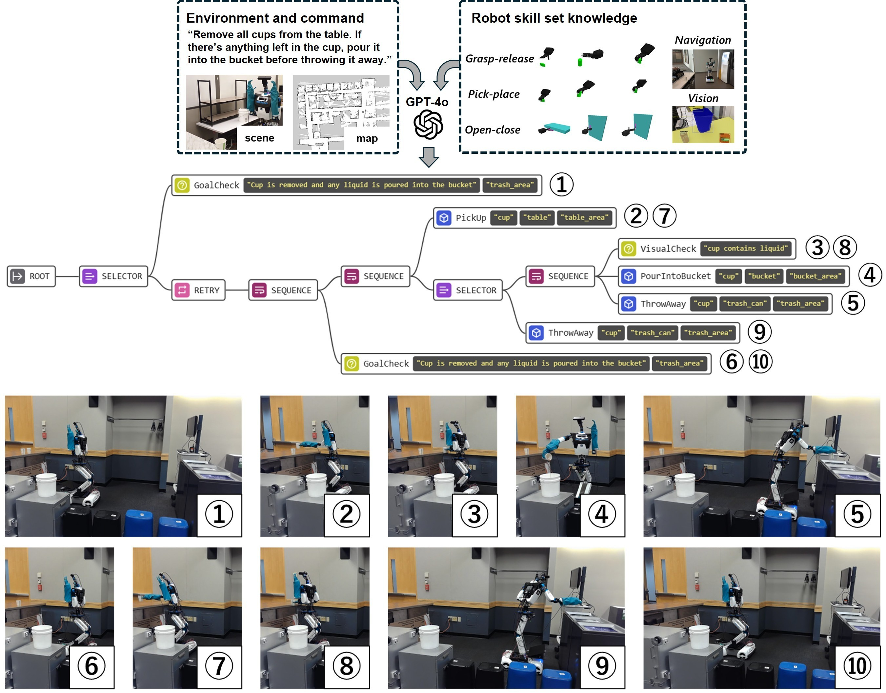
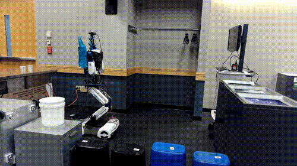

# VLM-driven Behavior Tree for Context-aware Task Planning

This repository provides sample code for the paper *"VLM-driven Behavior Tree for Context-aware Task Planning"* ([arXiv:2501.03968](https://arxiv.org/abs/2501.03968)).



## Overview

The code is divided into two main components:

1. **Task Planning Server**  
   - Utilizes GPT to perform **task planning**.
   - The task planning server leverages the open-source repository:  
[robotics-task-sequencer-system-framework](https://github.com/microsoft/robotics-task-sequencer-system-framework).  
This framework supports both **task planning** and **robot execution**.
   - Examples of the prompts used in the paper are available in the [prompt-examples](./prompt-examples)  directory for reference.

2. **Interactive Frontend**  
   - Visualizes the results as a **Behavior Tree (BT)**.  
   - Allows users to interactively manipulate the tree.  
   - Frontend code can be found in the [robot-teaching-frontend](./robot-teaching-frontend) repository.


## Bibliography
```
@article{wake2025vlm,
  title={VLM-driven Behavior Tree for Context-aware Task Planning},
  author={Wake, Naoki and Kanehira, Atsushi and Sasabuchi, Kazuhiro and Takamatsu, Jun and Ikeuchi, Katsushi},
  journal={arXiv preprint arXiv:2501.03968},
  year={2025}
}
```

## Contributing

This project welcomes contributions and suggestions.  Most contributions require you to agree to a
Contributor License Agreement (CLA) declaring that you have the right to, and actually do, grant us
the rights to use your contribution. For details, visit https://cla.opensource.microsoft.com.

When you submit a pull request, a CLA bot will automatically determine whether you need to provide
a CLA and decorate the PR appropriately (e.g., status check, comment). Simply follow the instructions
provided by the bot. You will only need to do this once across all repos using our CLA.

This project has adopted the [Microsoft Open Source Code of Conduct](https://opensource.microsoft.com/codeofconduct/).
For more information see the [Code of Conduct FAQ](https://opensource.microsoft.com/codeofconduct/faq/) or
contact [opencode@microsoft.com](mailto:opencode@microsoft.com) with any additional questions or comments.

## Trademarks

This project may contain trademarks or logos for projects, products, or services. Authorized use of Microsoft 
trademarks or logos is subject to and must follow 
[Microsoft's Trademark & Brand Guidelines](https://www.microsoft.com/en-us/legal/intellectualproperty/trademarks/usage/general).
Use of Microsoft trademarks or logos in modified versions of this project must not cause confusion or imply Microsoft sponsorship.
Any use of third-party trademarks or logos are subject to those third-party's policies.
