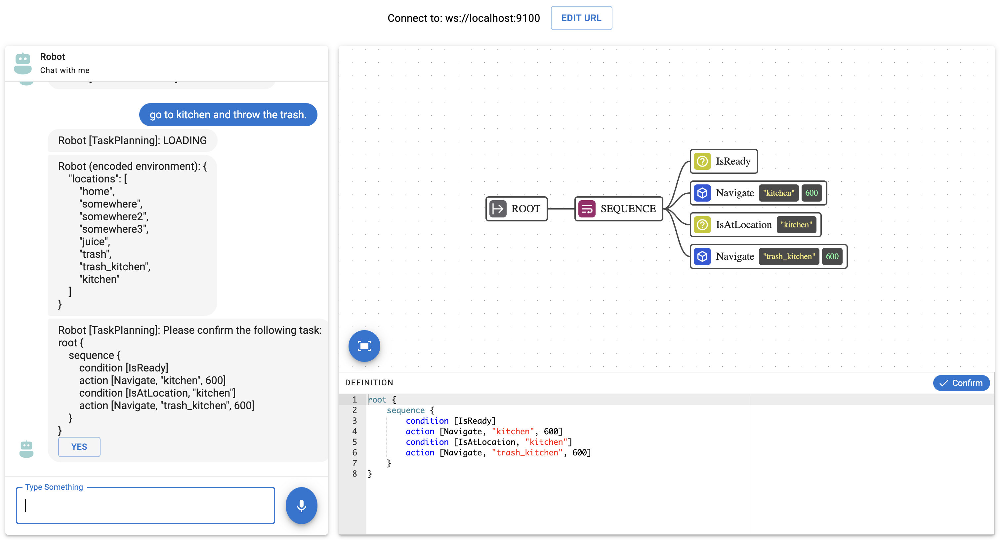

# Robot Teaching Frontend

## Table of Contents

- [Introduction](#introduction)
- [Development Environment](#development-environment)
  - [Using Docker Compose](#using-docker-compose)
  - [Using VSCode Devcontainer](#using-vscode-devcontainer)
- [Usage](#usage)
    - [Running the Development Server](#running-the-development-server)
    - [Build the project](#build-the-project)
- [Functionality Modification Guide](#functionality-modification-guide)
    - [UI Components](#ui-components)
    - [Logic and State Management](#logic-and-state-management)
    - [Third-party Libraries](#third-party-libraries)
- [Enabling Audio Responses](#enabling-audio-responses)

## Introduction

The Robot Teaching Frontend is a web application designed to connect to the Robot Teaching backend. It provides a chat interface, behavior tree visualization, and editing functionalities to facilitate user-robot interaction and teaching.



## Development Environment

1. Ensure Docker is running.
2. Build and run the Docker containers:
   ```bash
   docker compose run --service-ports web
   ```

### Install Third-party Libraries
This repository is built on top of [Mistreevous Visualiser](https://github.com/nikkorn/mistreevous-visualiser). Check the [README.md](src\libs\README.md) to install this library.


## Usage
Once you get into the shell of the container, you can run the development server or build the project.

### Running the Development Server

To start the development server and access the web interface, run:

```bash
npm run dev
```

Then, navigate to `http://localhost:3000` in your web browser.

### Build the Project

This repository provides sample code and is primarily intended for development purposes using npm run dev. While it may work in a development environment, the build process (npm run build) is not supported.

## Functionality Modification Guide
### UI Components
All UI components are located in the `src/components` directory. This includes:
- BehaviorTreeVisualizer
- Chat
- Common
- MainContent
- UrlSelection

### Logic and State Management
Custom hooks for managing logic and state are located in the `src/hooks` directory. 

Context providers are located in the `src/contexts` directory.

## Enabling Audio Responses

To enable audio responses, create .env file and fill in the VITE_SPEECH_API_KEY and VITE_SPEECH_REGION fields with your Azure Speech Service keys. Refer to [.env_sample](.env_sample).

To enable audio responses, create a `.env` file and fill in the `VITE_SPEECH_API_KEY` and `VITE_SPEECH_REGION` fields with your Azure Speech Service keys. Refer to [.env_sample](.env_sample) for an example of the file structure. You can retrieve your Speech key and region by following these steps:

1. **Create an Azure Speech resource**  
   - Log in to the [Azure Portal](https://portal.azure.com/).  
   - Search for "Speech" in the Marketplace and create a new Speech resource.  
   - Once created, navigate to your Speech resource's dashboard.

2. **Get the keys and region**  
   - Under **Keys and Endpoint**, you will find your **Key 1** (or **Key 2**) and the **Location** (region) for the Speech resource.  
   - Copy the key and region.

3. **Update your `.env` file**  
   - In your local repository, create a file named `.env` (if it doesn’t already exist).  
   - Populate the following environment variables with the values you copied:  
     ```bash
     VITE_SPEECH_API_KEY=<Your-Azure-Speech-Key>
     VITE_SPEECH_REGION=<Your-Azure-Speech-Region>
     ```
   - **Note**: Make sure **not to commit** your `.env` file to any public repository, as it contains sensitive credentials.